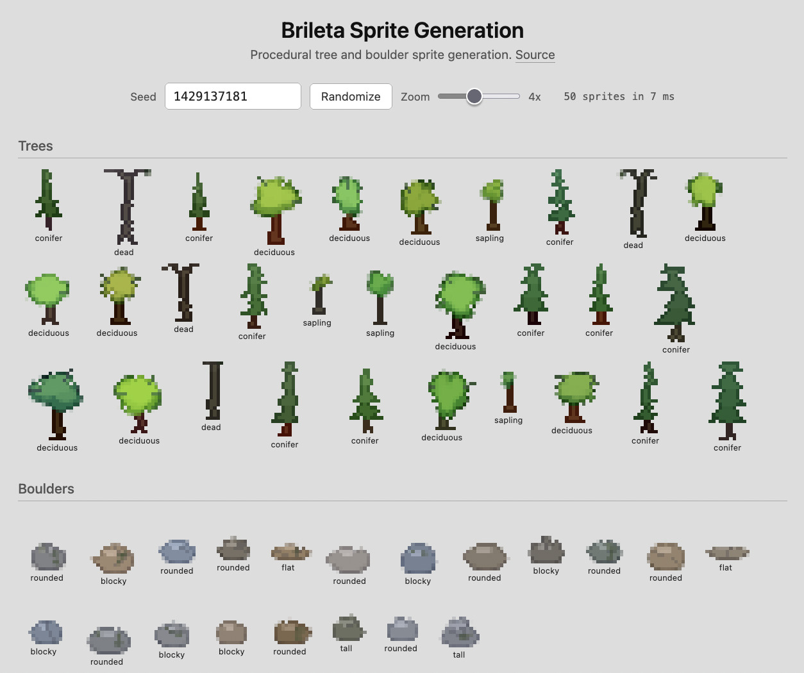

# brileta-sprites

Procedural tree and boulder sprite generation in TypeScript.

**[Try it live](https://mayz.github.io/brileta-sprites/demo/)** | **[How it works](https://markshtat.com/notebook/every-spruce-is-sacred)**



This library is a standalone TypeScript port of the tree and boulder generation from [Brileta](https://github.com/mayz/brileta). It's a faithful translation of the algorithms as of March 2026, released under MIT so you can use it however you want. It's not a mirror of the game's codebase - the two will diverge over time. Bug fixes and improvements here will be made independently.

## Quick start

```bash
npm install && npm run build
npm run dev
```

Then open http://localhost:8080/demo/.

## License

MIT
